<!-- markdownlint-disable MD009 MD012 MD022 MD024 MD025 MD031 MD033 MD036 MD047 -->
# Santander - Cibersegurança 2025 DIO - Ataques de Força Bruta

**Curso: Formação Cyber Security – (DIO)**

# Laboratório de Ataque de Força Bruta em Ambiente Controlado

Este repositório faz parte do meu estudo prático na formação em Cibersegurança da Digital Innovation One (DIO).
O objetivo é demonstrar, de maneira controlada e segura, como realizar ataques de força bruta em um ambiente isolado com máquinas virtuais, explorando mecanismos de autenticação e analisando suas vulnerabilidades.

Partimos do princípio de que as máquinas Kali Linux e Metasploitable2 já estão instaladas no VirtualBox. Este guia mostra apenas a configuração de rede necessária para realizar os testes e a execução dos ataques de força bruta.

## Objetivos do projeto

- Configurar ambiente seguro e isolado com máquinas virtuais
- Realizar análise, enumeração e reconhecimento de serviços
- Executar ataques simulados de força bruta
- Experimentar falhas reais em autenticação sem colocar sistemas reais em risco

## Ambiente utilizado

### 1. Kali Linux  
Máquina atacante utilizada para análise, enumeração e exploração.

**Configuração da rede:**

- Adaptador 1  
  - Conectado a: Placa de rede exclusiva de hospedeiro (Host-Only)  
  - Nome: `vboxnet0`
  
  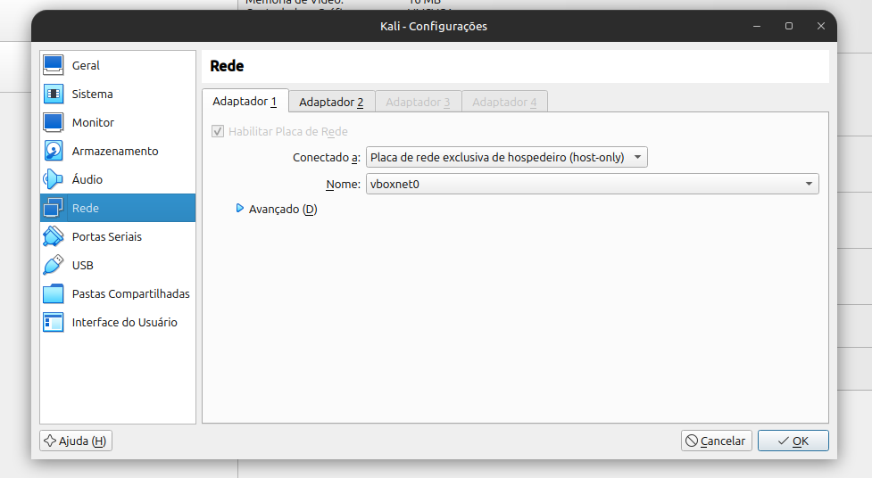

---

### 2. Metasploitable2  
Máquina alvo vulnerável, usada apenas para fins educacionais.

**Configuração da rede:**

- Adaptador 1  
  - Conectado a: Placa de rede exclusiva de hospedeiro (Host-Only)  
  - Nome: `vboxnet0`

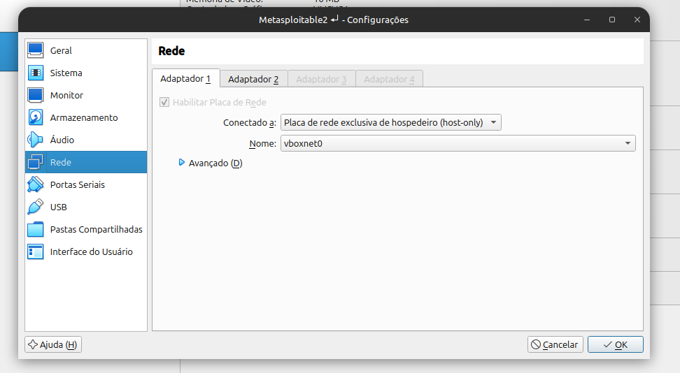

---

# Configuração de Rede

Com ambos os sistemas configurados para Host-Only, eles ficam dentro da mesma rede isolada, permitindo:

- Comunicação direta entre as máquinas
- Zero acesso à internet pelo alvo
- Segurança total do ambiente de testes

---

## Inicialização do Ambiente

Após configurar os adaptadores de rede nas duas máquinas virtuais, o próximo passo é **iniciar o Kali Linux e o Metasploitable2**.

Abaixo estão as duas VMs inicializadas:

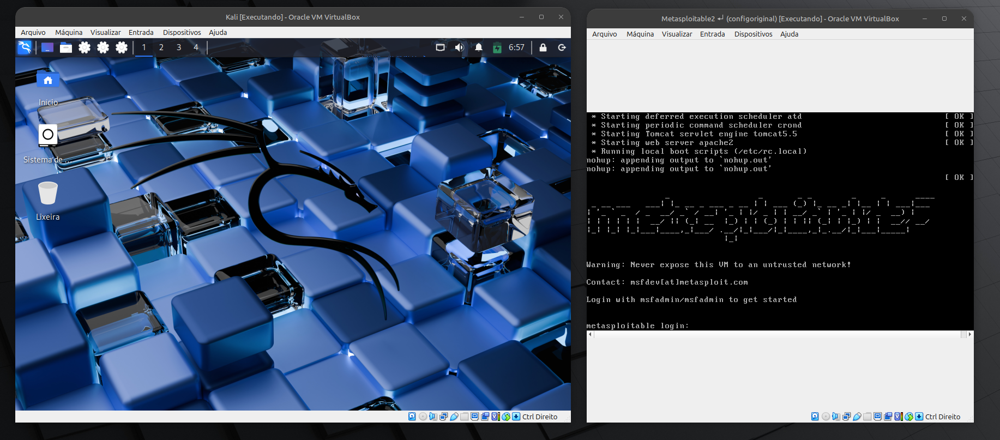

Com ambas as máquinas rodando, a primeira configuração importante deve ser feita no **Metasploitable2**.

---

## Criando um Snapshot no Metasploitable2

Antes de realizar qualquer ataque, mineração de dados, força bruta ou alteração de sistema, é fundamental criar um **snapshot** da máquina alvo.

O snapshot garante que:

- Podemos recuperar o estado original rapidamente  
- Testes não corrompem o ambiente  
- Reiniciar o laboratório fica mais rápido  
- Erros e travamentos não exigem reinstalação

**Passo para criar o snapshot:**

1. Desligue o Metasploitable2.
2. No VirtualBox, selecione a máquina.
3. Clique em **Snapshots** (ou Instantâneos).
4. Clique em **Take Snapshot**.
5. Nome:  
   No meu caso dei o nome de `configoriginal`
6. Confirme.

Exemplo visual:

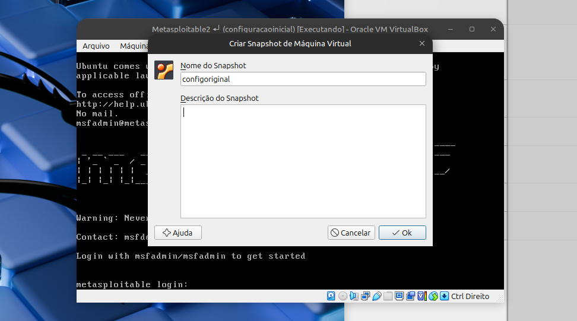

Depois disso, sempre que algo der errado ou durante vários testes consecutivos, basta restaurar o snapshot e o Metasploitable2 volta exatamente ao estado original.

---

## Verificação dos Endereços de IP

Com as máquinas inicializadas e o snapshot criado, o próximo passo é confirmar se cada sistema recebeu o endereço IP correto na interface Host-Only.

A verificação é feita com o comando:
ip a

## Kali Linux
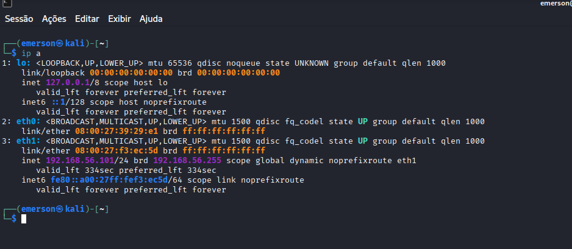

## Metasploitable2
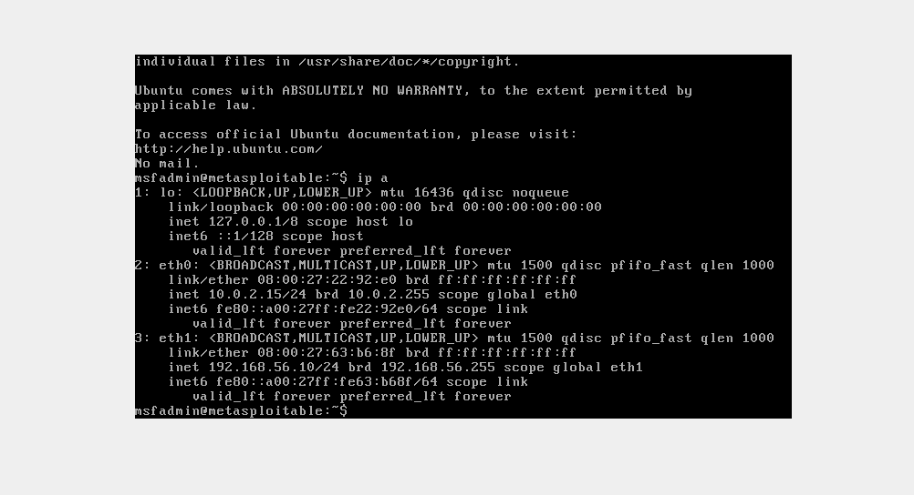

---
## Testando a Conexão entre as Máquinas
Com os endereços IP confirmados, o próximo passo é validar se as duas máquinas conseguem se comunicar dentro da rede Host-Only.

Para isso utilizamos o comando:

ping -c 3

Com os endereços IP confirmados, o próximo passo é validar se as duas máquinas conseguem se comunicar dentro da rede Host-Only.

Para isso utilizamos o comando:
ping -c 3 [IP do alvo]

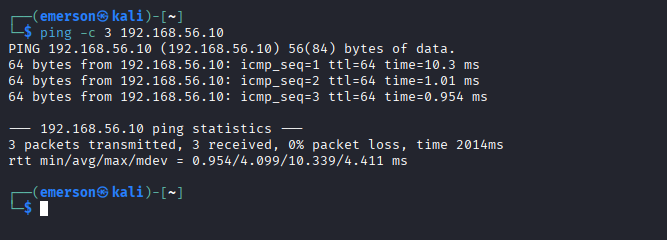

---
# Ataque de Força Bruta em FTP com Medusa

O primeiro ataque realizado neste laboratório consiste em testar senhas fracas no serviço FTP do Metasploitable2 utilizando a ferramenta **Medusa**.

O objetivo deste teste é demonstrar como credenciais fracas permitem acesso direto a serviços críticos, sem qualquer proteção adicional.

## Criação das Wordlists

A primeira etapa antes de executar qualquer ataque de força bruta é criar as listas de usuários e senhas que serão utilizadas nos testes.  
Essas wordlists foram criadas diretamente no Kali Linux usando o comando `echo -e`, que permite gerar arquivos simples de forma rápida.

---

### Criação da lista de senhas (pass.txt)

O arquivo `pass.txt` foi criado com o comando:

echo -e "123456\npassword\npassword\nmsfadmin" > pass.txt

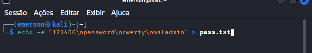

O arquivo users.txt foi criado com o comando:

echo -e "admin\nmsfadmin\nadmin\root" > users.txt

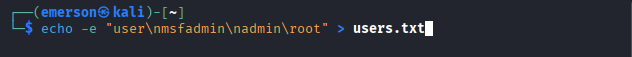

Arquivos salvos:

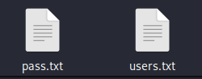

---
# Enumeração Inicial: Identificando Serviços com Nmap

Antes de realizar qualquer ataque, é fundamental descobrir quais portas e serviços estão abertos no Metasploitable2.  
Esse processo é conhecido como **enumeração**, e é a base de toda análise de segurança.

Utilizamos a ferramenta **Nmap**, que permite identificar serviços, versões e possíveis vulnerabilidades.

## Comando utilizado

No Kali Linux, executamos a varredura com detecção de versões:
nmap -sV 192.168.56.10

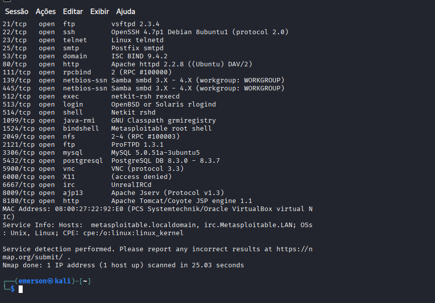

Essa etapa confirma que o Metasploitable2 está cheio de pontos de entrada para testes controlados, permitindo explorar autenticação, serviços web e mecanismos de acesso remoto.

---

# Ataque de Força Bruta em FTP com Medusa

Com a enumeração realizada, identificamos que o serviço **FTP (porta 21)** está ativo no Metasploitable2:

## Password Spraying Seguro (1 tentativa por usuário)
Neste exemplo vou realizar um teste só a senha "msfadmin" para todos os usuários da lista.

medusa -h 192.168.56.10 -U users.txt -p "msfadmin" -M ftp 6

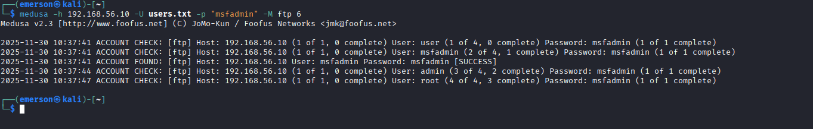

| Usuário    | Senha     | Resultado |
|------------|-----------|-----------|
| user       | msfadmin  | Falha     |
| msfadmin   | msfadmin  | SUCESSO |
| admin      | msfadmin  | Falha     |
| root       | msfadmin  | Falha     |

---

## O Arquivo estrutura.txt

Ele foi gerado com:
npx tree-cli -a -o estrutura.txt -I "node_modules,.git"

---
## Conclusão

Com isso finalizamos os testes de ataques propostos no laboratório.
Exploramos diferentes vetores de força bruta em um ambiente seguro e controlado, entendemos o comportamento dos serviços vulneráveis e reforçamos a importância de práticas fortes de autenticação.

Esse tipo de estudo é essencial para desenvolver uma visão ofensiva e defensiva em cibersegurança, sempre com foco em aprendizado e responsabilidade.

# dio-santander-cs-2025
